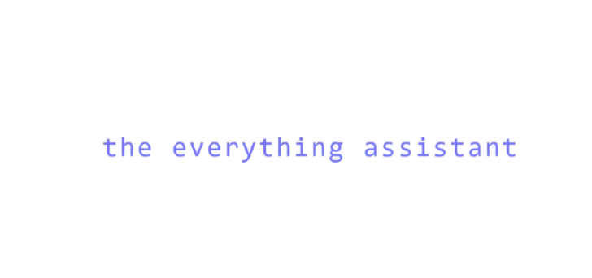

<p align="center">
  
</p>

<p align="center">
  <a href="https://the-everything-assistant.vercel.app">ask me anything here</a>
</p>

---

## About

This project is an AI assistant designed to demonstrate various capabilities, including conversational AI, multimodal input processing (like image analysis), and tool integration. It provides a solution to everything campus-related.

### Core Features

- **Conversational Interface**: Interact with the AI through a chat interface.
- **Tool Handling**: Integrate and utilize external tools or services.
- **Modular Structure**: Organized codebase with clear separation of concerns.
- **Microservices**: Some tools are built as microservices.

## Technology Stack

This project is built using modern web technologies:

- **Framework**: Next.js with TypeScript
- **UI**: Tailwind CSS
- **AI Integration**: Vercel AI SDk
- **Database**: Prisma ORM (with Neon)
- **Authentication**: NextAuth.js
- **Deployment**: Vercel, Heroku, Render

## Getting Started

1.  **Explore Capabilities**: Understand the core features and potential uses.
2.  **Set up Environment**: Configure necessary API keys and database connections.
3.  **Run Locally**: Get the project running on your development machine.

## Local Development

### Prerequisites

- Node.js (v18+)
- npm
- Git

### Installation

```bash
# Clone the repository
git clone https://github.com/theg1239/the-everything-assistant.git

# Navigate to the project directory
cd the-everything-assistant

# Install dependencies
npm install

# Run the development server
npm run dev
```

### Scripts

- `npm run dev` - Start the development server
- `npm run build` - Build for production
- `npm run start` - Start the production server
- `npm run lint` - Run linters
- `npm run format` - Format code
- `npm run format:check` - Check code formatting

## Project Structure

This project follows a modular Next.js monorepo structure with several key directories:

```
├── app/                # Next.js App Router (pages, API routes, layouts)
│   ├── api/
│   ├── chat/
│   ├── login/
│   ├── mgmt/
│   ├── layout.tsx
│   ├── not-found.tsx
│   └── page.tsx
├── components/         # Reusable React components
│   ├── backgrounds/
│   ├── legacy/
│   ├── ui/
│   └── ...
├── contexts/           # React Contexts for state management
├── hooks/              # Custom React Hooks
├── lib/                # Utilities, helpers, and core logic
│   ├── data/
│   ├── scrapers/
│   └── ...
├── prisma/             # Prisma schema and migrations
│   └── schema.prisma
├── providers/          # React Providers (session, theme, etc.)
├── public/             # Static assets (images, onboarding artwork, placements data, etc.)
│   ├── assets/
│   ├── onboarding-artwork/
│   └── placements/
├── services/           # External tool service integrations
│   ├── proxy-service/
│   └── reddit-scraper/
├── styles/             # Stylesheets
├── types/              # TypeScript type definitions
├── package.json        # Project manifest
├── next.config.ts      # Next.js configuration
└── ...                 # Other config files
```

### Notable Service Directories

- **services/proxy-service/**  
  Handles proxying, authentication, and external API requests. Contains its own entrypoint, config, and static files.

- **services/reddit-scraper/**  
  Standalon fetching and analysis service. Includes:
  - `scrapers/`: Reddit and image analysis scripts
  - `utils/`: Logging and utility functions
  - `knowledge-base/`: Knowledge base and RAG scripts
  - `logs/`: Log files
  - `public/`: Static files for the service

## Contributing

We welcome contributions! If you'd like to contribute, please follow these steps:

1.  Fork the repository.
2.  Create a new branch for your feature or bugfix.
3.  Make your changes and commit them with clear messages.
4.  Push your branch to your fork.
5.  Open a Pull Request to the main repository.

## Issues

If you encounter any issues or have suggestions for improvements, please open an issue on the GitHub repository.
